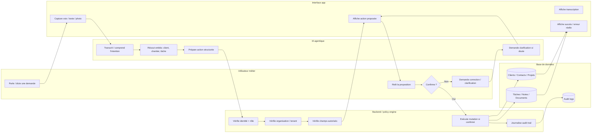
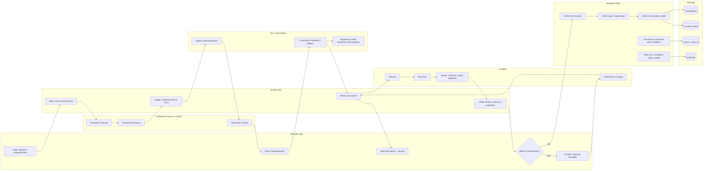
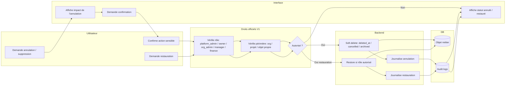

# Diagrammes swimlane — flux métier agentique bâtiment

## Statut

**Proposition UX / produit à intégrer aux flux métier de l'app.**

Ces diagrammes servent à visualiser les responsabilités entre l'utilisateur, l'interface, l'IA, le backend, la base de données et les rôles de validation.

---

## 1. Swimlane générique — voix → action métier → confirmation → DB

### Règle produit associée

- L'IA propose, mais n'exécute pas une action sensible sans confirmation.
- Le backend vérifie toujours identité, rôle, organisation et champs autorisés.
- L'UI n'affiche jamais un succès si la DB n'a pas réellement été modifiée.

---

## 2. Swimlane — réunion / discussion chantier enregistrée → transcription → compte-rendu validé

### Règle produit associée

- L'enregistrement doit être visible et annoncé.
- La transcription peut être automatique.
- Les tâches, décisions et réserves ne deviennent officielles qu'après validation humaine.
- L'audio ne doit pas être conservé durablement sans décision explicite.

---

## 3. Swimlane — annulation / restauration avec droits officiels V1

### Règle produit associée

- Par défaut, on ne détruit pas définitivement: on applique un soft-delete.
- Toute annulation/restauration est journalisée.
- La restauration dépend du domaine: projet, terrain, documents, finance.
